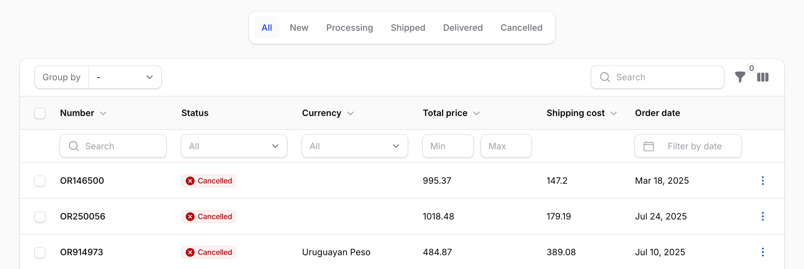

# Filament Header Filters

Inline header filters for [Filament](https://filamentphp.com/) tables. Attach any `BaseFilter` to a column header — select dropdowns, date pickers, min/max ranges, custom multi-field schemas — as a richer alternative to `searchable(isIndividual: true)`.

## Screenshot



## Requirements

- PHP 8.2+
- Filament v4.x or v5.x

## Installation

```bash
composer require leek/filament-header-filters
```

Add the `HasHeaderFilters` trait to any Livewire component that uses `InteractsWithTable` (resource list pages, custom Livewire table components):

```php
use Filament\Resources\Pages\ListRecords;
use Leek\FilamentHeaderFilters\Concerns\HasHeaderFilters;

class ListOrders extends ListRecords
{
    use HasHeaderFilters;
}
```

### Styles

If your panel uses a custom Vite theme (`->viteTheme(...)`), import the plugin CSS into your `theme.css` so Tailwind's build pipeline picks it up and cascade order is correct:

```css
@import '../../../../vendor/filament/filament/resources/css/theme.css';
@import '../../../../vendor/leek/filament-header-filters/resources/dist/filament-header-filters.css';
```

Then rebuild: `npm run build`. If you don't use a custom theme, the plugin's CSS loads automatically via `FilamentAsset`.

## Usage

Call `->headerFilter()` on any column and pass a filter instance.

### Dropdown filter

Use `SelectFilter` for exact-match column filtering. The default placeholder is "All".

```php
use App\Enums\OrderStatus;
use Filament\Tables\Columns\TextColumn;
use Filament\Tables\Filters\SelectFilter;

TextColumn::make('status')
    ->badge()
    ->headerFilter(
        SelectFilter::make('status')
            ->options(OrderStatus::class)
            ->native(false)
    )
```

### Min/max range filter

Use a custom `Filter` with two `TextInput` fields and `->columns(2)` for a side-by-side numeric range:

```php
use Filament\Forms\Components\TextInput;
use Filament\Tables\Columns\TextColumn;
use Filament\Tables\Filters\Filter;
use Illuminate\Database\Eloquent\Builder;

TextColumn::make('total_price')
    ->headerFilter(
        Filter::make('total_price_range')
            ->columns(2)
            ->schema([
                TextInput::make('min')->numeric()->placeholder('Min'),
                TextInput::make('max')->numeric()->placeholder('Max'),
            ])
            ->query(fn (Builder $query, array $data): Builder => $query
                ->when($data['min'] ?? null, fn (Builder $q, $v): Builder => $q->where('total_price', '>=', $v))
                ->when($data['max'] ?? null, fn (Builder $q, $v): Builder => $q->where('total_price', '<=', $v))
            )
    )
```

### Date range filter

Use `DatePicker` fields for a two-date range:

```php
use Filament\Forms\Components\DatePicker;
use Filament\Tables\Columns\TextColumn;
use Filament\Tables\Filters\Filter;
use Illuminate\Database\Eloquent\Builder;

TextColumn::make('created_at')
    ->label('Order date')
    ->date()
    ->headerFilter(
        Filter::make('order_date_range')
            ->columns(2)
            ->schema([
                DatePicker::make('from')->placeholder('From')->native(false),
                DatePicker::make('until')->placeholder('Until')->native(false),
            ])
            ->query(fn (Builder $query, array $data): Builder => $query
                ->when($data['from'] ?? null, fn (Builder $q, $v): Builder => $q->whereDate('created_at', '>=', $v))
                ->when($data['until'] ?? null, fn (Builder $q, $v): Builder => $q->whereDate('created_at', '<=', $v))
            )
    )
```

## Behavior

- Header filters share state with panel filters (`$tableFilters`). Filter indicators, reset, and session persistence all work.
- Header filters are always live — they apply immediately on change, regardless of `deferFilters()`.
- Field labels inside header filters are auto-hidden; the column header acts as the label.
- Hidden columns' header filters are not applied to the query.

## How it works

The package ships:

- `Column::macro('headerFilter', ...)`, `getHeaderFilter()`, `hasHeaderFilter()`
- `BaseFilter::macro('columnName', ...)`, `getColumnName()`, `isHeaderFilter()`
- `Table::macro('getHeaderFilters', ...)`, `hasHeaderFilters()`
- A `HasHeaderFilters` Livewire trait that wires filters into the table, seeds header filter state, and exposes `getTableHeaderFiltersForm()`
- A view override (`filament-tables::index`) that renders the header filter row under the column search row
- A small CSS file raising the z-index and lifting overflow clipping so dropdown / date picker popups escape the table container

The view override is a patched copy of Filament's table view. If you upgrade Filament and something breaks, please open an issue.

## Testing

```bash
composer test
```

## License

MIT. See [LICENSE.md](LICENSE.md).
